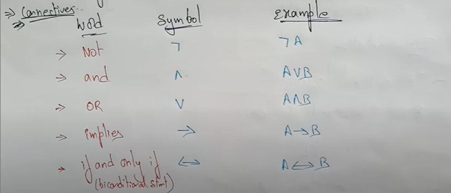
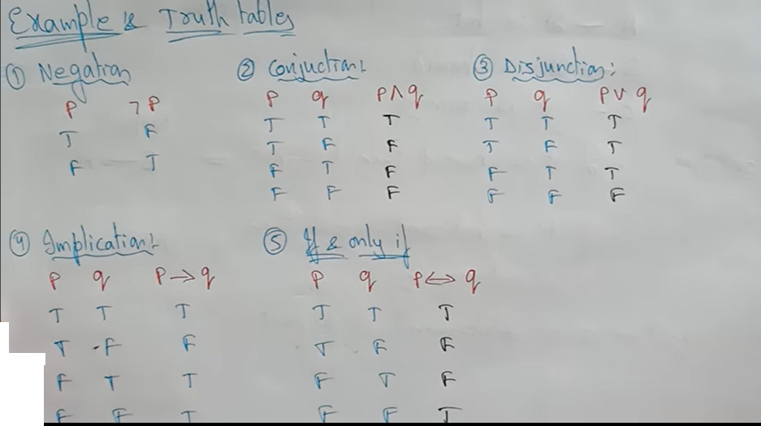
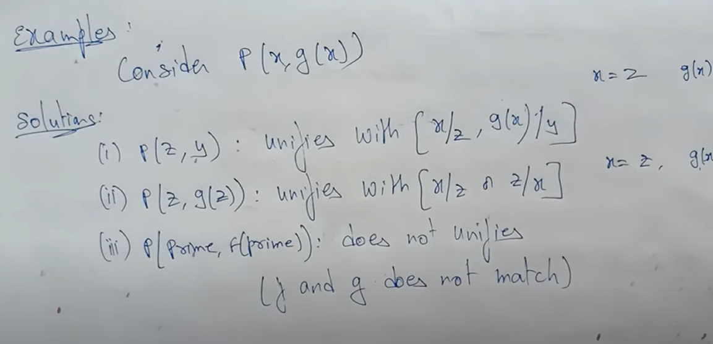
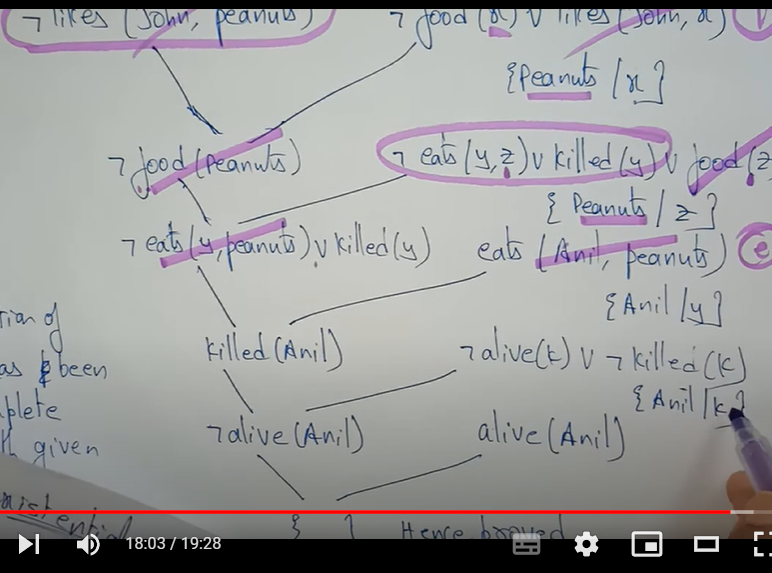
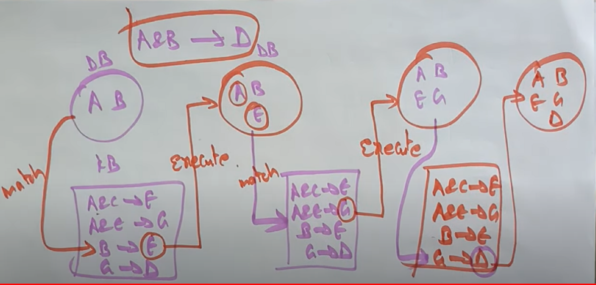
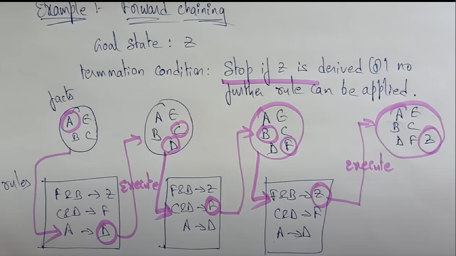

# AI Fundamentals

> Just another me watching a course and taking notes.

- **Definition;** “the science of making machines do things that would require intelligence if done by men.” Marvin Minsky

- **Operational Definition;** “AI is the field of computer science that studies how to make computers do tasks for which humans are still the best today.” E.Rich

## Logial Representation
It is a language with some concrete rules that deals with propositions and havs no ambiguity in representation.

Consist of: 
- **Semantic:** well formed sentence
- **Syntaxe:** truth of the meaning to a sentence

# Logical Representation is

## 1- Proposional Logic
- PL is the simplest logic
- a proposition is a declarative statment that's either true or false. 

Propositinal logic cannot predicate or assmue, it can say either true or false.

### Connectivity

 

### Truth Table

 

## Examples

A- It is HOT 
B- It is humid 
C- It is rainning

**Conditions:**  
1- If it is humid, then it is hot  
2- if it is hot and humid then it is not raining

|   Conditions |  Proposition Logic |
|---|---|
| Condition 1  |  B=>A | 
| Condition 2  |  A+B => C | 

### Limitation Of PL
- We cannot represent relations like **All**, **some**, or **none**.
  - **All** the girls are intelligent
  - **Some** apples are sweet.
- PL has limited expressive power.
- In PL, we cannot describe the statements in terms of their properties or logical relationships

## 2- First Order predicat logic
First order logic is another way of knowlege representation in A.I.
 It is an extension to PL (propostional Logic)
 
 - FOL is also known as predicate logic. It is a powerful language that develops information about the objects in a more easy way and can also express the relationship between those objects. not just (True/False).
 
 - FOL does not only assume that the world contains facts like "PL" but also assumes. 
 1- Objects, A, B, people, colors, pits,ettc 
 2- Relationships: It can be any relation such, sisters, brothers, has color 
 3- Functions: Father of, best friend, end of... 
 
 As a natural language, First order logic has two main parts 
 a- syntax   
 b- semantics 
 
 
 ### Semantic of FOL: Basic Elements

|   Elements |  Syntax|
|---|---|
|      Constant      |  1,2 A, Hiehaaa | 
|   Variables         |  x,y,z,a,b,c,d | 
|            Predicats| Brother, Father, >, <  | 
|          Functions  |  Sqrt, etc | 
|          Connectives  |  No, apply, and, or, <=> (AI syntax pls) | 
|          Equality  |  = | 
|         Quantifiers   |  ∀, ∃ | 

 ### Atomic Sentences
 - Atomic sentences are the most basic sentences of FOL. These sentences are formed ffrom a predicate symbol followed by praenthesis with a sequence of terms.
 
 - we can represent atomic sentences as predicate ( term1, term2,.... termn)  
 
 **Example1:** Yaya and Soso are brothers.  
 Terms: Yahya, Soso  Predicate: Brothers  Result: Brothers( Yaya, Soso)
 
 
  **Example2:** Tommy is a dog  
 Terms: Tommy  Predicate: Dog  Result: Dog(Tommy)
 
  ### Complex Sentences
- Complex sentences are made by comibining atomic sentences using **connectives**(or, and, implies etc..).

Real meaning: Predicate1(Term1, Term2, TermN..) "Connectivity"  Predicate2(Term1, Term2, TermN..)
 
 #### First Order Logic Statements divided into 2 parts.
 - Subject: it is the main part of the statement
 - Predicate: can be defined a relation which binds two atmos together in a statement
 
 
 **Example:**  
  State: "X is an integer"
  
 First part; X is a subject of the statement  
 Second part, is an integer is known as predicate
 
 ---
 
  ### Quantifiers
  - a quantifier is a language element which generates quantificator
  - these are the symboles that permit to determine or identitfy the range and the score of the variable in the logic expression.
  
  There are two type of quantifier: 
  #### a- Universal Quantifier ( for all, everyone, everything)  -- range in math "∀" 
  It is a symbol of logical representation which specifies that the statement within its range is true for everything or every instance of particular thing
  
  if x is a varibale, the ∀soit X is read as:  
 for all x
  for each x 
for every x
  
  
**Example:** All men drink coffee  
  let x is variable  
  x1 drink coffee, Vma9louba(and) x2 drink coffee and xn drinkcoffee.
  
  So we can write it as 
 	∀x man(x) --> drink (x, cofee) 
  > if i'm not using the conectivity "->" than u could call it an atomic sentence ;)
  
  There are all x where x is a man who drink coffe   You say also, there is x where is is men who drink coffe!! smart me!!
  
  
 All birds fly, predicate is fly(bird)  ∀x bird(x) -> fly(x)
 
Every man respects his parent, predicate is respect (x,y) where x=man, y=parent  
∀x man(x) -> respects (x, parent)
  
  ##### b- Existential quantifier ( for some, atleast one)   --scope in math "∃"
  It is the type of quantifier which express that the start within its score is true for atleast one instance of something
   here we always use, and or conjuction symbol Vma9louba 
  
  
  if x is a variable then existential quantifier will be 
    ∃ (X) is read as:
    there exists a x  for some "x"  for atleast an "x"
  
  
  Some more examples 
Some boys are intelligent. 
x1 is intelli or x2 is intelligent or xn is intelligent  
∃x:boy(x) and intelligent (x)

> note: IMPORTANTTTTTT

- the main connective for ∀ is "->'
- the main connective for ∃ is 'and'

##  Inference
Inference in FOL is used to dedce new facts sentences from, existing sentences. Before understanding First Logic Inference suite, let's understand some basic teminologies used in FOL.

1- Substitution  
It is a fundamentals operation performed on termas and forumas It occurs in all inference sys in FOL: F[a/x] F[b/x]
 substitute a constant "a" in the place of variable.

2- Equality  
FOL logic does not only use predicate and terms for making atomic sentence but also uses another way, whch is equality in FOL.   eq, brother (John)= smoth   here the obj reffered by brother (john) is smiliar to obj refered by smoth. The equality symbol can also be used with negation to represent that two terms are notn the same objects.
  eq, no(x=y) equivalent to x<>y

## FOL Inference rules for quantifiers
=> Pl, we also have inference rules for FOL.

### Universal generalization: ∀
It is a valid inference rule which states that if premise p(c) is true for any arbitrary element c in the universe of discourse, then we can have a concusions ∀x p(x)
<b>r It can be respresented as, P(c)/∀x P(x)   Example: Let's present , P(C): " a byte contains 8 bits"   so for ∀xp(x), " all bytes contain 8 bits" it will also be true

### Universal instantiation (eliminiation): ∀
  It can be appiled multipl times to add new sentences. The rule says that we can infer any sentence that is premisses of p(c) by substituting a ground term c  ( constant within domain x) for ∀x p(x) for any object in the universe of course we have   **∀x p(x)/p(c)**  Example: Every person like ice-cream => ∀xp(x) we can infer that " John like ice cream" => P(c).
  
  
### existential instantiation:(eliminiation) ∃
  which is a valid reference rule in FOL. It can only applied only once to replace the existential sentence.  this rule states that one can infer p(c) per the foruma given in the form il existe x p(x) for a new constant syn'c'a    **∃xP(x)/P(c)**
  
### existential Introductions: ∃
  It is also called as existential generalization, this rule states that if there is some element c in the unverise of discourse which has a proerty P, then we can infer that there exists something in the unversie which has property P.
   **P(c)/il ∃xP(x)**   Pinky(c) got good markes in math, therefore someone, got good marks in math, ∃ means(someone)

# Unification
It is all about making the expression look identical. So, far the given expressions to make them look idenntical we need to do substitution.   
Eg: P(x, F(y)), p(a, F(g(z)), i can say these are identical why ?  Because x=a, y= g(z)  Unification gives, [a/x, g((z)/y]
 Because xin place of a, y in place of g(z)  

- with both the substituitons, the first expression will be identical to the second expression & the substitution set will be [a/x, g((z)/y]

### Unifcation Conditions
- Predicate symbol mst be same, atoms or expression with different predicate symbol can never be unified. ( p/p)
- number of arguments in both expressions must be identical (number of argument 2/2)
- unification will fail if there are two smiliar variables present in same expression

### Unification Algo
=> algorithm, unify (l1, l2)

#### STEP1
- If l1 or l2 is a variable or constant, then:   If l1 & l2 are identical return "NIL"
- Else if L1 is a variable, then if L1 occurs in L2 then return FAIL,  Else return {(L1/L2)}
- Else if L2 is a variable, then if l2 occrs in l1 then return Fail,   Else return {(L1/L2)}
- Else return FAIL

#### STEP2
If the initial predicate sumbol in l1&l2 are not identical, then return FAIL.

#### STEP3
If l1&l2 have different number of arguments, then return fail.

#### STEP4
Set SUBST to nil

#### STEP5 
Loop:  
for in<-1 to no f argments in l1:  a) call the unify with the ith argument of l1 and the ith argument of l2 putting result in s  b) if s=FAIL then return FAIL if s is not equal to NIL Then  (i) apply s to the remaind of both l1&l2< (ii) subs= append (s1,subst)

#### STEP6
return SUBST

###  Algo Implementation
#### Step1; Initialize the substituion set be empty
#### Step2; recursively unify atomic sentences  a) check for identical expression match b)if one expression a variable and other is a term which does not contain variable vi then:  ->substitue ti/vi -> add ti/vi to the substitution settlist ->if both the expressions are functions, then functions must be similar & number of arguments must be same in both expressions.   eg: p(x,f(y)) and   p(a,f(z) ===> f must stay f!!!

# Resolution
Resolution is a theorem proving technique that proof by contradictions.  It is used, if there are various stunts are fiven & need to prove a conclusion of those stunt.  Unification is key concept in proofs by resolutions<bbr>resolutions is a single reference rule which can efficiently operate on conjunctive normal form or clausal form.
> clause: dijunction of literals is called clause. 

> conjunctive NF: a sentence represented as a conjunction of clauses said to CNF.

## Steps for resolution
1- conversion of facts into FOL 
2- conver FOL stunt into CNF 
3- negate the stunt which eed to prove by contradiction 
4- draw  resoution graph (unification) 

Examples:
a- John likes all kind of food  
b- apple and vegetable are food  
c- anything anoyone eat and not killed is food  
d- anil eats peanuts and still alive. 
e- henry eats everything that hanry eats 
h- prove by resolution that  John likes peanuts 

## Step 1 conversion of facts into FOL
 a-  ∀x: food(x) -> likes (John, X)  
 b- food (apple) and food (vegetablees) 
 c- ∀x∀y: eats(x,y) and not killed(x) -> food(y) 
 d- eats(anit, peantu)and alive(anil) 
 e- ∀x: eats (anil,x) -> eats(hanry, x) 
 f- ∀x: not killed(x) -> alive 
 g- ∀x:alive(x)->killed(x)  BOTH ARE ADDED PREDICATES 
 h- likes(John, Peanuts)
 
## Step2: conversion of FOL int CNF
 This makes it easier for resulution proofs
 
 ### 1- Eliminiate all implications -> & rewrite
 
 -  The foruma: a->b= NotA or B
 
 a-  ∀x: Not food(x) OR likes (John, X)  
 b- food (apple) and food (vegetablees) 
 c- ∀x∀y: not[ eats(x,y) and not killed(x)] OR food(y) 
 d- eats(anit, peantu)and alive(anil) 
 e- ∀x: noteats (anil,x) or eats(hanry, x) 
 f- ∀x: not [not killed(x)] or alive  
 g- ∀x:not[alive(x)] or killed(x) 
 h- likes(John, Peanuts)
 
 ### 2- Move negation (not) inwords (inside) "oncher el no"
 a-  ∀x: Not food(x) OR likes (John, X)  
 b- food (apple) and food (vegetablees) 
 c- ∀x∀y: not  eats(x,y) or  killed(x)] and food(y)   //change
 d- eats(anit, peantu) and alive(anil) 
 e- ∀x: noteats (anil,x) or eats(hanry, x) 
 f- ∀x: not [not killed(x)] or alive(x)  
 g- ∀x:not[alive(x)] or not killed(x) //changes dunno
 h- likes(John, Peanuts)
 
 ### 3- Rename variables or standardize variables
 
 a-  ∀x: Not food(x) OR likes (John, X)  
 b- food (apple) and food (vegetablees) 
 c- ∀y∀z: not  eats(y,z) or  killed(y)] and  food(z)   //change
 d- eats(anit, peantu) and alive(anil) 
 e- ∀x: noteats (anil,x) or eats(hanry, x) 
 f- ∀g: not  killed(g)] or alive(g)  
 g- ∀k:not[alive(k)] or not killed(k) //changes dunno
 h- likes(John, Peanuts)
 
 ### 4- Eliminate existential instantioation quantifier by eliminiation
But in our case there is no existential stuff, so all remain same

### 5- drop universal quantifiers: (qlqsoit x,y or ilexiste etc)
 a-   Not food(x) OR likes (John, X)  
 b- food (apple) and food (vegetablees) 
 c-  not  eats(y,z) or  killed(y)] and  food(z)   //change
 d- eats(anit, peantu) and alive(anil) 
 e-  noteats (anil,x) or eats(hanry, x) 
 f-  not  killed(g)] or alive(g)  
 g- not[alive(k)] or not killed(k) //changes dunno
 h- likes(John, Peanuts)
 

## Step3: Negate the statement to be proved
On this stunt, we will apply negation to the conclusion stunt, which will written as (not likes(job, peanuts)

## Step4: Draw resolution Graph
Now, in this step, we will solve the problem by resolution tree using substitution, for the above problem it wll be given as
 
 

{} Hence Proved (empty)

### Examples of Resolution 
  
#### Structue:Stp1:step2
  
- If it is sunny & warm day you will enjoy: sunny and warn -> enjoy: not sunny or warn or enjoy: 
- if it is rainy you will get wet: raining ->wet: not raining or wet: 
-  it is a warn day: warn 
- it is rainning: rain 
- it is sunny: sunny  
  
  
- goal; u will enjoy, **STEP 3**. Negate the statement that u need to prove so? => Not enjoy
  
  **step4**: draw the graph
  
   Not enjoy ( take frist statement with it cause it's contraduction to it)  
   
  Not enjoy-----------Not sunny or not worm or enjoy ( apply unification method))  equal  not sunny or not warm ( now fine where there is not warm and not sunny but dont take the one with exact ex the second NO!)
  
    take the third step with it( it is warm day)   notsunny or not warm ---- warm equals not sunny 
  
  Check where there is contradiction(the negative of it) so find where there sunny ( last option)
  not sunny -- sunny = {} contrdiction proved.
  
  

# Forward chaining/Reasoning
It is a form of reasoning which starts with atomic sentences in the knowledge base and applies inference rules in the gorward direction to extract more ddata until  a goal is reached.  

## Properties
  - it moves from bottom to top
  - it is a process of making a conclusion based on knownn facts or data, by starting from the initial state and reach the goals
- forward chaining approach is alson called a s data driven as we reach to the goal using availablen data
- forward chaining approach is commonl used in the expert system.
  
## Example1
Rule1: if A and C hen F: a&c->f  
Rule2: if a and e then a: A&E->A 
Rule3: if b then E: B->E  
Rule4: if a then d: C->D  
  
 
 **Database: AB  
  Problem: Proove if a and B true, then d is true: meaning i have to prove A&B->D 
  
  
  
  
  ## Example2
  
  oal state: Z  Termination condition; Stop if z is derived or no further rule can be applied.
  
   facts: a e b c  
  rules: f&b->z c&d->f a->d
  
  

  
# backward chaining
  
# AI Techniques; Search, Knowledge &  Abstraction
  
# Score Playing - Scope of AI
  
# NLP - Scope of AI
  
# Expert Systems - Scope of AI
  
# Robotics - Scope of AI
  
  
# Learning from Observation
  
# Inductive Learning
  
# Decision Tree Learning Algo
  
# AI - Application
